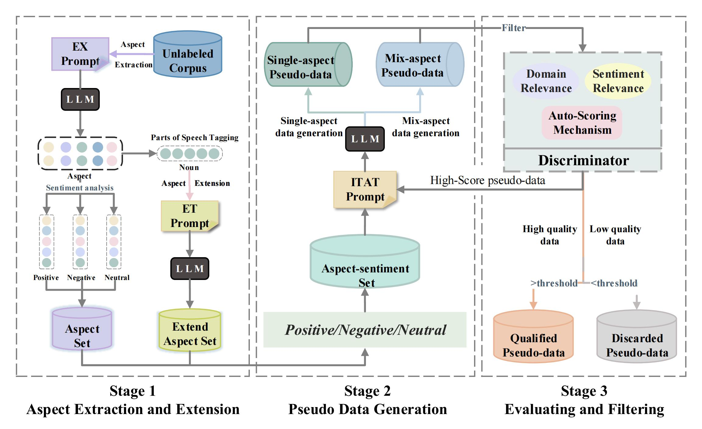

# IterD: Iterative Data Augmentation with Large Language Models for Aspect-based Sentiment Analysis
\[In submission\] Code for: [Iterative Data Augmentation with Large Language Models for
Aspect-based Sentiment Analysis](https://export.arxiv.org/abs/2407.00341)

we propose a systematic **Iter**ative **D**ata augmentation framework, namely **IterD**, to boost the performance of ABSA. The core of IterD is to leverage the powerful ability of large language models (LLMs) to iteratively generate more fluent and diverse synthetic labeled data, starting from an unsupervised sentence corpus. Extensive experiments on 4 widely-used ABSA benchmarks show that IterD brings consistent and significant performance gains among 5 baseline ABSA models. More encouragingly, the synthetic data generated by IterD can achieve comparable or even better performance against the manually annotated data.


Our framework is as follows.

</img>

## Requirements

* Python 3.8
* tqdm 4.64.0
* jsonlines 4.0.0
* nltk 3.8.1

## Dataset 
We conduct the main experiments on 4 widely-used ABSA benchmarks, Laptop14, Restaurant14, Restaurant15 and Restaurant16.

- Original data: "./original_data/"
- Generated data: "./pseudo_data/"

## How to run

 Aspect Extraction and Extension:

    #Acquisition of aspect
    python run_aspect.py 
    #part-of-speech process and sentiment analysis
    python ./aspect_preprocess/pos_tag.py

Pseudo Data Generation:

    python single_aspect_data_generate.py
    python mix_aspect_data_generate.py

Data Process(data convert):

```
python ./dataset_converters/xx2xx.py
```

## Citation

If you find this useful in your research, please consider citing:

```
@inproceedings{Li2024IterativeDA, 
title={Iterative Data Augmentation with Large Language Models for Aspect-based Sentiment Analysis},  
author={Haiyun Li and Qihuang Zhong and Ke Zhu and Juhua Liu and Bo Du and Dacheng Tao},  year={2024}
}
```
